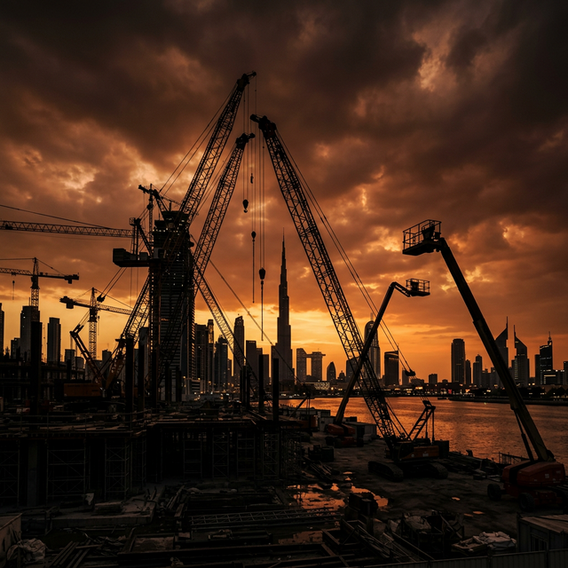

# Al Falak Transport — Website Assets Manifest

All assets listed below need to be prepared and placed in the specified paths relative to the website root.

---

## UI / BRAND ASSETS  → `images/ui/`

| File Name | Description | Format | Size |
|---|---|---|---|
| `logo-mark.svg` | Square "AF" geometric mark (already embedded inline in HTML as SVG; export as standalone file for favicons) | SVG | 38×38px |
| `logo-full-dark.svg` | Full horizontal logo for dark backgrounds | SVG | ~200×44px |
| `logo-full-light.svg` | Full horizontal logo for light backgrounds (amber band CTA) | SVG | ~200×44px |
| `favicon.ico` | Browser tab favicon from logo mark | ICO | 32×32 + 16×16 |
| `favicon-192.png` | PWA icon | PNG | 192×192 |
| `favicon-512.png` | PWA icon large | PNG | 512×512 |
| `og-image.jpg` | Open Graph / social share image | JPG | 1200×630px |

---

## HERO IMAGES  → `images/hero/`

| File Name | Description | Placement | Size |
|---|---|---|---|
| `hero_equipment.jpg` | Hero background photo — dramatic wide shot of a crane or boom lift on a Dubai construction site. Dark, moody, golden hour recommended. | Homepage hero right panel | 1200×900px |
| `hero_mobile.jpg` | Cropped/portrait version of hero for mobile | Homepage hero mobile | 800×600px |

---

## FLEET EQUIPMENT PHOTOS  → `images/fleet/`

Each photo should be a clean, high-contrast equipment shot. Dark background or outdoor/site background. Consistent crop: 4:3 ratio.

### Spider Cranes
| File Name | Equipment |
|---|---|
| `urw706_spider_crane.jpg` | URW706 Spider Crane — 6.0t |
| `urw506_spider_crane.jpg` | URW506 Spider Crane — 3.0t |
| `urw376_spider_crane.jpg` | URW376 Spider Crane — 2.9t |
| `urw295_spider_crane.jpg` | URW295 Spider Crane — 2.9t |
| `urw245_spider_crane.jpg` | URW245 Spider Crane — 2.4t |
| `urw095_spider_crane.jpg` | URW095 Spider Crane — 0.995t |

### Mobile Cranes
| File Name | Equipment |
|---|---|
| `250t_mobile_crane.jpg` | 250 Ton Mobile Crane |
| `160t_mobile_crane.jpg` | 160 Ton Mobile Crane |
| `100t_mobile_crane.jpg` | 100 Ton Mobile Crane |
| `50t_mobile_crane.jpg` | 50 Ton Mobile Crane |
| `25t_mobile_crane.jpg` | 25 Ton Mobile Crane |

### Boom Lifts
| File Name | Equipment |
|---|---|
| `57m_telescopic_boom.jpg` | 57M Telescopic Boom Lift |
| `48m_telescopic_boom.jpg` | 48M Telescopic Boom Lift |
| `28m_telescopic_boom.jpg` | 28M Telescopic Boom Lift |
| `16m_telescopic_boom.jpg` | 16M Telescopic Boom Lift |
| `43m_articulated_boom.jpg` | 43M Articulated Boom Lift |
| `26m_articulated_boom.jpg` | 26M Articulated Boom Lift |
| `20m_articulated_boom.jpg` | 20M Articulated Boom Lift |

### Spider Lifts
| File Name | Equipment |
|---|---|
| `52m_spider_lift.jpg` | 52M Spider Lift |
| `32m_spider_lift.jpg` | 32M Spider Lift |
| `23m_spider_lift.jpg` | 23M Spider Lift |
| `19m_spider_lift.jpg` | 19M Spider Lift |

### Scissor Lifts
| File Name | Equipment |
|---|---|
| `23m_diesel_scissor.jpg` | 23M Diesel Scissor Lift |
| `18m_electric_scissor.jpg` | 18M Electric Scissor Lift |
| `15m_diesel_scissor.jpg` | 15M Diesel Scissor Lift |
| `12m_diesel_scissor.jpg` | 12M Diesel Scissor Lift |
| `12m_electric_scissor.jpg` | 12M Electric Scissor Lift |
| `10m_electric_scissor.jpg` | 10M Electric Scissor Lift |
| `8m_electric_scissor.jpg` | 8M Electric Scissor Lift |

### Excavators
| File Name | Equipment |
|---|---|
| `30t_excavator.jpg` | 30 Ton Excavator |
| `20t_excavator.jpg` | 20 Ton Excavator |
| `1-5t_mini_excavator.jpg` | 1.5 Ton Mini Excavator |
| `5t_mini_excavator.jpg` | 5 Ton Mini Excavator |
| `3t_mini_excavator.jpg` | 3 Ton Mini Excavator |
| `2t_mini_excavator.jpg` | 2 Ton Mini Excavator |

### Other Equipment
| File Name | Equipment |
|---|---|
| `cat950_wheel_loader.jpg` | CAT 950 Wheel Loader |
| `500kva_generator.jpg` | 500 kVA Diesel Generator |
| `100kva_generator.jpg` | 100 kVA Diesel Generator |
| `5t_diesel_forklift.jpg` | 5 Ton Diesel Forklift |
| `3t_diesel_forklift.jpg` | 3 Ton Diesel Forklift |
| `s770_skid_steer.jpg` | S770 Bobcat Skid Steer |
| `s450_skid_steer.jpg` | S450 Bobcat Skid Steer |
| `jcb4cx_backhoe.jpg` | JCB 4CX Backhoe Loader |
| `jcb3cx_backhoe.jpg` | JCB 3CX Backhoe Loader |
| `17m_telehandler.jpg` | 17M Telehandler |
| `14m_telehandler.jpg` | 14M Telehandler |
| `star10_manlift.jpg` | Star 10 Vertical Manlift |
| `toucan12e_manlift.jpg` | Toucan 12E Plus Manlift |

---

## CONTENT / SECTION PHOTOS  → `images/content/`

| File Name | Description | Used In |
|---|---|---|
| `site_operation_wide.jpg` | Wide shot of Dubai construction site with equipment operating | About section / Services |
| `operator_certified.jpg` | RTA-certified operator in cab or beside equipment | Why Choose section |
| `crane_night.jpg` | Dramatic nighttime or golden hour crane shot | Services page hero |
| `fleet_yard.jpg` | Aerial or wide view of equipment fleet in yard | About page |

---

## HOW TO ACTIVATE IMAGES IN THE CODE

In each HTML file, equipment cards have a commented-out `` tag:

```html
<!-- Replace placeholder below with:
  
-->
```

Simply uncomment the `` tag and remove the placeholder `<div class="f-ph">` block above it.

For the hero image on `index.html`:
```html
<!-- Replace the hero_img_placeholder div with: -->

```

---

## GOOGLE MAPS EMBED (contact.html)

Replace the placeholder in `contact.html` with a Google Maps embed:
1. Go to Google Maps → Search "Dubai Investment Park 2"
2. Click Share → Embed a map → Copy HTML
3. Paste inside the `.map-placeholder` div, replacing the placeholder content

---

## RECOMMENDED IMAGE SPECS

- **Format**: JPG (photos), SVG (logos/icons), WebP optional for performance
- **Fleet photos**: 800×600px minimum, 4:3 ratio, consistent lighting
- **Hero**: 1200×900px, high contrast, dark tones preferred
- **Compression**: 80–85% JPG quality for web

---

*Total fleet images needed: 48 photos + 2 hero images + 4 content images + 7 UI/brand assets = ~61 assets*
